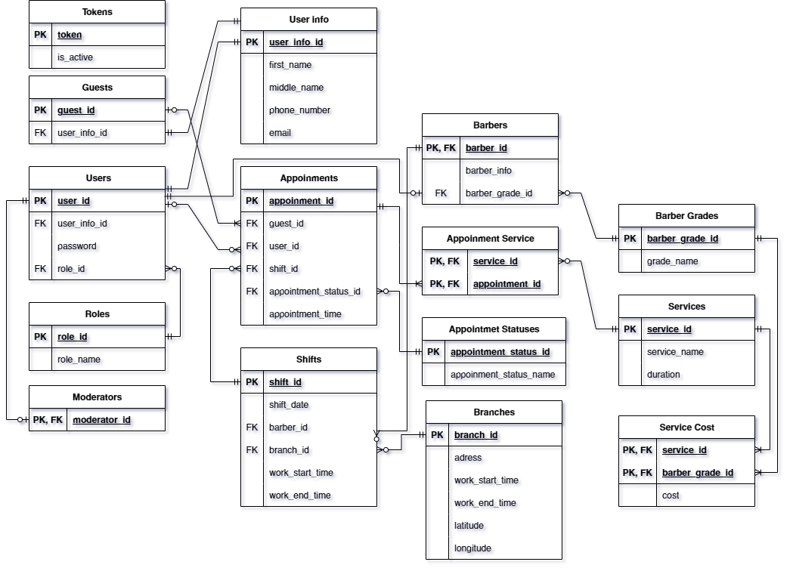
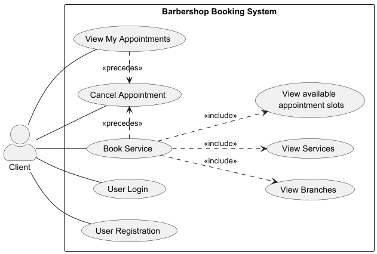
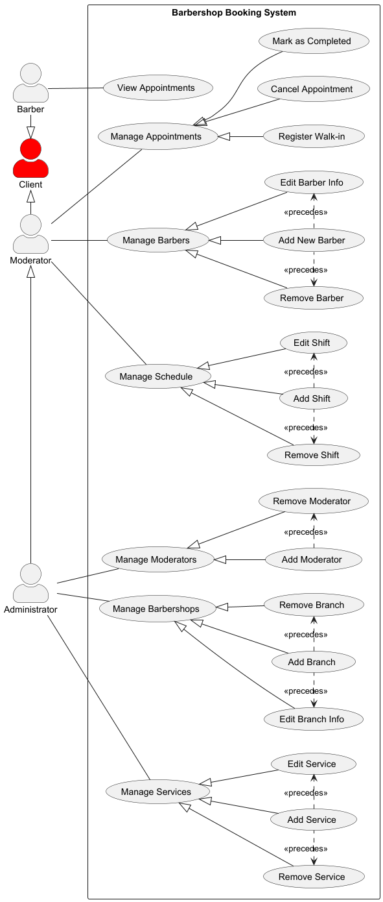

# IN PROGRESS...
### 🏆 Барбершоп (REST API на Spring Boot)

REST API для бронирования услуг, управления клиентами и расписанием мастеров.

## 🚀 Функционал
- Онлайн-запись на стрижку через API
- Управление расписанием барберов
- Личный кабинет клиентов
- Панель администратора для управления услугами

## 🛠️ Технологии
- **Backend:** Java (Spring Boot, Spring Security, Spring Data JPA)
- **База данных:** PostgreSQL
- **Аутентификация:** JWT

